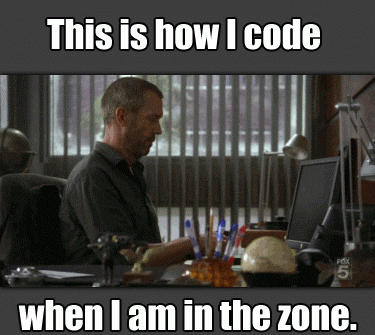

## Hi there, I'm Sajmon 👋

 

I am a self-taught developer from Bochum, Germany.
Always eager to explore, learn something new and collaborate.
Currently looking for a full-time job opportunity ⚡

- 🔭 Creating a small app to share bucketlists with friends
- 🌱 I’m currently learning TypeScript & Redux
- 📫 How to reach me: nowak.sajmon@gmail.com
- 💻  Connect with me on [LinkedIn](https://www.linkedin.com/in/sajmon-nowak-483067167/)

 

Current Stack
---
> Languages and Tools

<table>
  <tr>
    <td align="center" width="96">
        
       JavaScript
    </td>
    <td align="center" width="96">
        
       React
    </td>
    <td align="center" width="96">
        
       Sass
    </td>
    <td align="center" width="96">
        
       SC
    </td>
    <td align="center" width="96">
        
       NodeJS
    </td>
    <td align="center" width="96">
        
       MongoDB
    </td>
  </tr>
</table>